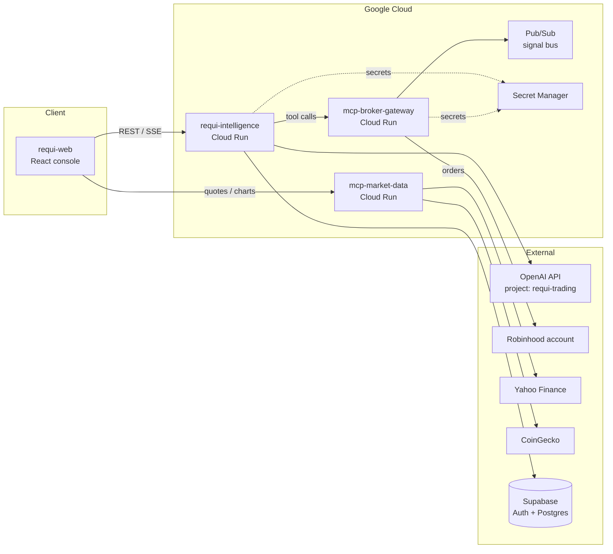

# Requi Trading — DevOps Launch Runbook

**Audience:** DevOps / platform engineer
**Goal:** Take Requi Trading from repos to a running production system.
**Priorities (in order):** 1) **Intelligence service** (ChatGPT API) → 2) **MCP servers** (broker control) → 3) User management (Supabase + GCP) → 4) Guardrails (AI limits + user approval) → 5) Live market data (Yahoo Finance + CoinGecko) → 6) CI/CD & observability.

---

## 0. Launch order at a glance

| # | Workstream | Repo | Runs on | Blocks |
|---|-----------|------|---------|--------|
| 1 | Intelligence (AI console) | `requi-intelligence` | Cloud Run | Everything |
| 2 | MCP broker gateway (Robinhood) | `requi-mcp-broker-gateway` | Cloud Run | Trading |
| 3 | MCP market data (Yahoo + CoinGecko) | `requi-mcp-market-data` | Cloud Run | Charts |
| 4 | User auth + DB | Supabase (managed) | Supabase | Accounts, approvals |
| 5 | Frontend web app | `requi-web` | Cloud Run / CDN | UI |
| 6 | Infra as code | `requi-infra` | GCP (Terraform) | All |

All repos live under the **`requi-trading-git`** GitHub org. Suggested layout (create any that are missing):

```
requi-trading-git/
├─ requi-web                  # React frontend (already built — Vite + TS)
├─ requi-intelligence         # ChatGPT API service — the "Intelligence" console backend
├─ requi-mcp-broker-gateway   # MCP server: accounts, positions, staged/live orders (Robinhood)
├─ requi-mcp-market-data      # MCP server: quotes, OHLCV (Yahoo Finance + CoinGecko)
└─ requi-infra                # Terraform: GCP project, Cloud Run, Secret Manager, Pub/Sub
```

**Architecture**



---

## 1. Phase 0 — Accounts & prerequisites (30 min)

Before touching code, confirm these exist:

- [ ] **GCP project** (e.g. `requi-trading-prod`) with billing enabled. APIs to enable:
  ```bash
  gcloud services enable run.googleapis.com secretmanager.googleapis.com \
    pubsub.googleapis.com cloudbuild.googleapis.com artifactregistry.googleapis.com
  ```
- [ ] **Supabase project** (e.g. `requi-trading`) — free tier is fine to start. Note the **Project URL**, **anon key**, **service_role key**, and **JWT secret** (Settings → API).
- [ ] **OpenAI platform** — the project **`requi trading`** is already created at platform.openai.com. You only need to issue keys and set limits (Phase 1).
- [ ] **Robinhood account** for the broker gateway. Enable 2FA (TOTP). Read the warning in §3.2 first — Robinhood has **no official public equities API**; the gateway wraps the unofficial private API, which can break or violate ToS [^1^]. For production money movement, prefer an official broker API (see §3.3).
- [ ] **CoinGecko API account** — free Demo plan to start (keyless/10K calls/mo); WebSocket streaming requires a paid Analyst plan [^2^].
- [ ] **Artifact Registry** repo for containers:
  ```bash
  gcloud artifacts repositories create requi --repository-format=docker --location=us-central1
  ```

**Golden rule:** no secrets in git. Every secret lives in **GCP Secret Manager**; Cloud Run services mount them as env vars. Supabase keys, OpenAI key, Robinhood credentials, CoinGecko key — all go through Secret Manager (§5.2).

---

## 2. Phase 1 — Intelligence service (PRIORITY 1)

The Intelligence console (the chat UI in `requi-web`) talks to `requi-intelligence`, a thin Node/TypeScript service that wraps the **OpenAI API platform**.

### 2.1 Connect the existing OpenAI project ("requi trading")

The project already exists on the OpenAI API platform. To wire it up:

1. Go to **platform.openai.com → Settings → Projects → "requi trading"**.
2. **Create a service account + API key** inside that project (Settings → Service accounts → *Add*). Service-account keys are scoped to the project and don't expire with a user's session — use these for servers, never personal keys.
3. Note the **Project ID** (`proj_...`) — pass it with every request so usage is attributed to "requi trading".
4. **Set spend guardrails now** (Settings → Limits / Budget):
   - Monthly **budget cap** (hard stop) — e.g. start at $100.
   - **Rate limits** per model (RPM/TPM) — caps blast radius of a runaway loop.
   - Enable **usage alert emails** at 50% / 80% / 100%.
5. Store the key in Secret Manager:
   ```bash
   echo -n "sk-proj-..." | gcloud secrets create OPENAI_API_KEY --data-file=-
   echo -n "proj_..."   | gcloud secrets create OPENAI_PROJECT_ID --data-file=-
   ```

### 2.2 Service skeleton (`requi-intelligence`)

Stack: Node 20 + TypeScript + Hono (or Express), deployed to Cloud Run. One streaming endpoint is enough for launch.

```ts
// src/openai.ts
import OpenAI from "openai";

export const openai = new OpenAI({
  apiKey: process.env.OPENAI_API_KEY,           // service-account key from Secret Manager
  project: process.env.OPENAI_PROJECT_ID,       // attributes usage to "requi trading"
});

export const MODEL = process.env.OPENAI_MODEL ?? "gpt-4.1";   // fast+cheap default
export const MODEL_HEAVY = process.env.OPENAI_MODEL_HEAVY ?? "gpt-4.1"; // strategy parsing
```

```ts
// src/routes/chat.ts — POST /v1/chat  (SSE stream to the console)
import { openai, MODEL } from "../openai.js";
import { STRATEGY_TOOL } from "../tools.js";

export async function chatHandler(c) {
  const { messages, userId } = await c.req.json();
  // TODO: verify Supabase JWT (§4.4) and resolve userId from it — never trust the client.

  const stream = await openai.responses.create({
    model: MODEL,
    input: [
      { role: "system", content: SYSTEM_PROMPT },
      ...messages,
    ],
    tools: [STRATEGY_TOOL],          // ← converts prompts into structured strategy objects
    stream: true,
  });

  c.header("Content-Type", "text/event-stream");
  c.header("Cache-Control", "no-cache");
  return c.stream(async (s) => {
    for await (const event of stream) {
      await s.write(`data: ${JSON.stringify(event)}\n\n`);
    }
  });
}
```

**System prompt + structured output** — this is what turns a pasted text strategy into a machine-executable object (see also §6.1):

```ts
// src/tools.ts
export const SYSTEM_PROMPT = `You are Requi Intelligence.
You parse text-based trading strategies into structured execution plans.
You NEVER place trades. You produce a StrategyPlan object and, when the
user asks to run it, you create an APPROVAL REQUEST. Orders execute only
after explicit user confirmation via the approval flow.`;

export const STRATEGY_TOOL = {
  type: "function",
  name: "emit_strategy_plan",
  description: "Convert a pasted text strategy into a validated execution plan.",
  parameters: {
    type: "object",
    additionalProperties: false,
    required: ["title", "asset_class", "entry", "exit", "sizing"],
    properties: {
      title:       { type: "string" },
      asset_class: { type: "string", enum: ["stocks", "crypto", "options", "futures"] },
      entry:       { type: "string" },
      exit:        { type: "string" },
      stop_loss:   { type: "string" },
      take_profit: { type: "string" },
      sizing:      { type: "string", description: "e.g. risk 1.5% equity, max 5 positions" },
      max_notional_usd: { type: "number" },
    },
  },
  strict: true,   // structured outputs: the model must match this schema
};
```

### 2.3 Model & cost policy

| Setting | Launch value | Where |
|---|---|---|
| Console chat model | `gpt-4.1-mini` (cheap) | `OPENAI_MODEL` |
| Strategy parse model | `gpt-4.1` (strict JSON) | `OPENAI_MODEL_HEAVY` |
| Max output tokens / call | 1,500 | request param `max_output_tokens` |
| Per-user daily token cap | 200K | enforce in service, read from Supabase `ai_limits` |
| Monthly budget cap | $100 hard stop | OpenAI project limits |

### 2.4 Deploy

```bash
cd requi-intelligence
gcloud run deploy requi-intelligence \
  --source . --region us-central1 --allow-unauthenticated=false \
  --set-secrets OPENAI_API_KEY=OPENAI_API_KEY:latest,OPENAI_PROJECT_ID=OPENAI_PROJECT_ID:latest \
  --set-env-vars OPENAI_MODEL=gpt-4.1-mini,OPENAI_MODEL_HEAVY=gpt-4.1
```

Keep `--allow-unauthenticated=false`. The frontend calls it through an identity-aware proxy or with a signed ID token; the service additionally verifies the Supabase user JWT (§4.4).

**Phase 1 done when:** pasting a strategy into the console streams a reply and returns a valid `StrategyPlan` JSON. No broker connectivity required yet.

---

## 3. Phase 2 — MCP broker gateway with Robinhood (PRIORITY 2)

### 3.1 What we're building

A **remote MCP server** (`requi-mcp-broker-gateway`) exposing broker control as MCP tools over **Streamable HTTP** on Cloud Run. Use the official TypeScript SDK (`@modelcontextprotocol/sdk`, v1.x) — servers are built with `McpServer`, tools are declared with Zod input schemas, and remote deployment uses `StreamableHTTPServerTransport` [^3^].

```bash
mkdir requi-mcp-broker-gateway && cd requi-mcp-broker-gateway
npm init -y && npm i @modelcontextprotocol/sdk zod express
npm i -D typescript @types/node @types/express
```

### 3.2 Robinhood connection — read this first

Robinhood offers **no official public API for equities trading**. What exists:

| Path | Official? | Notes |
|---|---|---|
| Private app API via wrappers (`robin_stocks` Python, `robinhood` npm forks) | ❌ Unofficial | Works today, but undocumented, may break anytime, and sits in a ToS grey zone [^1^]. Requires username/password + 2FA TOTP. **Demo/paper only.** |
| Robinhood Crypto API | ✅ Official (crypto only) | API keys from the Robinhood app; HMAC-signed REST. Fine for crypto order flow. |
| Official broker APIs: **Alpaca**, **Interactive Brokers**, **Tradier**, **SnapTrade** (SnapTrade = aggregation API that covers Robinhood read-only) | ✅ Official | Recommended for production equities/options. Alpaca & IBKR have first-class paper trading. |

**Recommendation:** build the gateway against a `BrokerAdapter` interface. Ship the **Robinhood unofficial adapter for the demo**, and an **Alpaca adapter for production** — same MCP tools, swap the adapter by env var. This keeps you launchable today without betting the company on an unofficial API.

```ts
// src/broker/adapter.ts
export interface BrokerAdapter {
  getAccounts(): Promise<Account[]>;
  getPositions(accountId: string): Promise<Position[]>;
  getQuote(symbol: string): Promise<Quote>;
  stageOrder(order: OrderRequest): Promise<StagedOrder>;     // never sends
  submitStagedOrder(stagedId: string): Promise<OrderResult>; // sends only after approval
  cancelOrder(orderId: string): Promise<void>;
}
// BROKER_ADAPTER=robinhood | alpaca   (env var selects implementation)
```

### 3.3 Robinhood unofficial adapter (demo)

Use `robin_stocks` (Python) behind a small FastAPI shim, or a maintained npm fork directly in Node. Example with a Python shim:

```python
# shim/main.py  (FastAPI, runs inside the mcp-broker-gateway container)
import os, pyotp, robin_stocks.robinhood as r
from fastapi import FastAPI

app = FastAPI()

@app.on_event("startup")
def login():
    totp = pyotp.TOTP(os.environ["RH_TOTP_SECRET"]).now()
    r.login(os.environ["RH_USERNAME"], os.environ["RH_PASSWORD"],
            mfa_code=totp, store_session=True)

@app.get("/accounts")
def accounts():  return r.load_account_profile()

@app.get("/positions")
def positions(): return r.build_holdings()

@app.post("/orders/stage")
def stage(o: dict):
    # Build and validate the order payload WITHOUT submitting.
    return {"staged": True, "payload": o}

@app.post("/orders/submit")
def submit(o: dict):
    return r.order(o["symbol"], o["quantity"], o["side"],
                   limitPrice=o.get("limit_price"), timeInForce="gfd")
```

Secrets (never in git):
```bash
echo -n "you@example.com" | gcloud secrets create RH_USERNAME --data-file=-
echo -n "••••••••"        | gcloud secrets create RH_PASSWORD --data-file=-
echo -n "BASE32TOTPSEED"  | gcloud secrets create RH_TOTP_SECRET --data-file=-
```
Use a **dedicated Robinhood account with a small balance** for the demo. Rotate the TOTP seed custody tightly; anyone with these three secrets controls the account.

### 3.4 MCP tools to expose (v1)

```ts
// src/index.ts
import { McpServer } from "@modelcontextprotocol/sdk/server/mcp.js";
import { StreamableHTTPServerTransport } from "@modelcontextprotocol/sdk/server/streamableHttp.js";
import { z } from "zod";
import express from "express";

const server = new McpServer({ name: "requi-broker-gateway", version: "0.1.0" });

server.tool("get_accounts", "List broker accounts linked to this user.",
  {}, async () => json(await broker.getAccounts()));

server.tool("get_positions", "Open positions for an account.",
  { account_id: z.string() }, async ({ account_id }) => json(await broker.getPositions(account_id)));

server.tool("get_quote", "Latest quote for a symbol.",
  { symbol: z.string() }, async ({ symbol }) => json(await broker.getQuote(symbol)));

// ── Trading: ALWAYS two-step. stage → (user approval) → submit ──
server.tool("stage_order",
  "Validate and stage an order. Does NOT send it. Returns a staged_id that expires in 10 minutes.",
  {
    account_id: z.string(),
    symbol: z.string(),
    side: z.enum(["buy", "sell"]),
    quantity: z.number().positive(),
    order_type: z.enum(["market", "limit"]),
    limit_price: z.number().positive().optional(),
    strategy_plan_id: z.string().describe("ID of the StrategyPlan this order belongs to"),
  },
  async (input) => json(await orders.stage(input)));

server.tool("submit_staged_order",
  "Submit a previously staged order. REQUIRES approval_token issued by the user-approval flow.",
  {
    staged_id: z.string(),
    approval_token: z.string().describe("One-time token from the user's explicit approval"),
  },
  async (input) => json(await orders.submit(input)));

server.tool("cancel_order", "Cancel a working order.",
  { order_id: z.string() }, async ({ order_id }) => json(await broker.cancelOrder(order_id)));

const app = express();
app.use(express.json());
app.post("/mcp", async (req, res) => {
  const transport = new StreamableHTTPServerTransport({ sessionIdGenerator: undefined });
  await server.connect(transport);
  await transport.handleRequest(req, res, req.body);
});
app.listen(process.env.PORT ?? 8080);
```

Test locally before deploying:

```bash
npm run build
npx @modelcontextprotocol/inspector node build/index.js   # fire tool calls from a web UI [^3^]
```

### 3.5 Wire MCP into Intelligence

The Intelligence service calls the gateway's tools when a plan is approved. Two safe patterns — pick **B**:

- A) Expose MCP tools directly to the model — **don't for v1** (the model could chain calls in unsafe ways).
- B) **Server-mediated execution**: the model only emits `StrategyPlan`; deterministic service code maps plan → `stage_order` calls, creates an approval request, and only after user approval calls `submit_staged_order`. The LLM never holds the keys.

---

## 4. Phase 4 — Supabase user management

### 4.1 Project setup

1. Supabase dashboard → the existing **`requi-trading`** project (or create one, region close to `us-central1`).
2. **Authentication → Providers**: enable **Email** and **Google** (OAuth creds from Google Cloud console; redirect URL = Supabase callback).
3. Copy: Project URL, `anon` key (frontend), `service_role` key (backend only — Secret Manager), **JWT secret** (backend token verification).

### 4.2 Schema (run in the SQL editor)

```sql
create table profiles (
  id uuid primary key references auth.users on delete cascade,
  display_name text, email text, plan text default 'free',
  created_at timestamptz default now()
);

create table broker_connections (
  id uuid primary key default gen_random_uuid(),
  user_id uuid references profiles(id) on delete cascade,
  broker text not null,                 -- 'robinhood' | 'alpaca' | ...
  label text, status text default 'connected',
  credentials_ref text not null,        -- Secret Manager path, NOT raw creds
  created_at timestamptz default now()
);

create table strategies (
  id uuid primary key default gen_random_uuid(),
  user_id uuid references profiles(id) on delete cascade,
  title text, source_text text, plan jsonb,    -- parsed StrategyPlan
  status text default 'draft'                   -- draft|paper|live|paused
);

create table approvals (
  id uuid primary key default gen_random_uuid(),
  user_id uuid references profiles(id) on delete cascade,
  staged_order jsonb not null,
  status text default 'pending',        -- pending|approved|rejected|expired
  approval_token uuid default gen_random_uuid(),
  expires_at timestamptz default now() + interval '10 minutes',
  decided_at timestamptz
);

create table ai_limits (                 -- per-user AI + trading guardrails
  user_id uuid primary key references profiles(id),
  daily_token_cap int default 200000,
  max_order_notional numeric default 5000,
  daily_notional_cap numeric default 20000,
  allowed_symbols text[] default null,  -- null = all
  paper_only boolean default true,      -- ← starts TRUE for every user
  kill_switch boolean default false
);

create table audit_log (
  id bigint generated always as identity primary key,
  user_id uuid, actor text, action text, payload jsonb,
  created_at timestamptz default now()
);
```

### 4.3 Row Level Security (mandatory)

```sql
alter table profiles enable row level security;
alter table broker_connections enable row level security;
alter table strategies enable row level security;
alter table approvals enable row level security;

create policy "own rows" on profiles for all using (auth.uid() = id);
create policy "own rows" on broker_connections for all using (auth.uid() = user_id);
create policy "own rows" on strategies for all using (auth.uid() = user_id);
create policy "own rows" on approvals for all using (auth.uid() = user_id);
-- ai_limits & audit_log: service_role only — no client policies.
```

### 4.4 Verifying users from Cloud Run services

Frontend signs in with Supabase JS → gets a user JWT. Every call to `requi-intelligence` / MCP sends `Authorization: Bearer <supabase_jwt>`. Services verify it against the Supabase **JWT secret** (or JWKS) and extract `sub` as `userId`. Never accept a user ID from the request body.

```bash
echo -n "<supabase-jwt-secret>" | gcloud secrets create SUPABASE_JWT_SECRET --data-file=-
echo -n "<service_role-key>"   | gcloud secrets create SUPABASE_SERVICE_ROLE --data-file=-
```

---

## 5. Phase 5 — Google Cloud infrastructure

### 5.1 Service map

| Component | GCP service | Notes |
|---|---|---|
| requi-web | Cloud Run (or Firebase Hosting/Cloud CDN) | Static Vite build — CDN is cheaper |
| requi-intelligence | Cloud Run, private | 1–10 instances, concurrency 80 |
| mcp-broker-gateway | Cloud Run, private | min 1 instance (warm Robinhood session) |
| mcp-market-data | Cloud Run, private | caches quotes in memory 5–15s |
| Signal/audit events | Pub/Sub topic `order-events` | gateway publishes, logger subscribes |
| Secrets | Secret Manager | every secret, rotated quarterly |
| Deploys | Cloud Build + Artifact Registry | triggered from GitHub |

### 5.2 Secrets checklist

```
OPENAI_API_KEY, OPENAI_PROJECT_ID,
SUPABASE_JWT_SECRET, SUPABASE_SERVICE_ROLE, SUPABASE_URL,
RH_USERNAME, RH_PASSWORD, RH_TOTP_SECRET,
COINGECKO_API_KEY,
ALPACA_API_KEY, ALPACA_API_SECRET        (production broker path)
```

Grant the Cloud Run **runtime service account** `roles/secretmanager.secretAccessor` on each secret — nothing else gets access.

### 5.3 Terraform skeleton (`requi-infra`)

```hcl
# keep it boring: one module per service
module "intelligence" {
  source     = "./modules/cloud-run-service"
  name       = "requi-intelligence"
  image      = "us-central1-docker.pkg.dev/requi-trading-prod/requi/intelligence:latest"
  public     = false
  secrets    = ["OPENAI_API_KEY", "OPENAI_PROJECT_ID", "SUPABASE_JWT_SECRET"]
  min_instances = 0
  max_instances = 10
}
module "broker_gateway" {
  source     = "./modules/cloud-run-service"
  name       = "requi-mcp-broker-gateway"
  image      = "us-central1-docker.pkg.dev/requi-trading-prod/requi/mcp-broker:latest"
  public     = false
  secrets    = ["RH_USERNAME", "RH_PASSWORD", "RH_TOTP_SECRET", "SUPABASE_JWT_SECRET"]
  min_instances = 1          # keep Robinhood session warm
}
```

---

## 6. Phase 6 — From prompt to account control (safely)

This is the core pipeline. It answers: *how does a pasted prompt become real control over a brokerage account — with limits and approval?*

### 6.1 The pipeline (deterministic, not model-driven)

```
User pastes text strategy
  → Intelligence calls OpenAI (structured output) → StrategyPlan JSON
  → validate against ai_limits (paper_only? symbols? notional?)
  → store in strategies (status = draft)
User clicks "Run"
  → service maps plan → stage_order calls on MCP gateway
  → insert approvals row (pending, 10-min expiry) → push notification to user
User approves in UI (explicit click — always required)
  → service checks: approval valid + not expired + limits OK + kill_switch off
  → submit_staged_order(staged_id, approval_token)
  → result to Pub/Sub order-events → audit_log
```

**Non-negotiables**
1. The LLM **never** calls order tools directly — it only emits plans.
2. Every order is **staged first**, and every submit requires a **one-time approval token** from an explicit user action.
3. `paper_only = true` for all new users; flipping to live requires the owner to verify identity + acknowledge risk in the UI.
4. All of it lands in `audit_log` (who, what, when, payload hash).

### 6.2 AI limits (enforce in code, not in prompts)

| Limit | Launch default | Enforced where |
|---|---|---|
| `paper_only` | `true` | gateway: live submits rejected |
| `max_order_notional` | $5,000/order | stage_order |
| `daily_notional_cap` | $20,000/day | stage_order (sum of today's approved) |
| `allowed_symbols` | null (all) or list | stage_order |
| `daily_token_cap` | 200K tokens | intelligence service |
| `kill_switch` | false | checked before every submit; owner UI toggle halts a user instantly |
| Approval expiry | 10 minutes | approvals.expires_at |
| Order types | market, limit only | stage_order schema |

Kill switch (owner): one button per user + one global. Global kill = set env `TRADING_HALTED=true` on the gateway → all submits return 503. Wire it to a Cloud Run env update so it takes effect in seconds without a redeploy.

---

## 7. Phase 7 — Live charts: Yahoo Finance + CoinGecko

### 7.1 Yahoo Finance (stocks)

Yahoo has no official public API; the community `yahoo-finance2` (npm) / `yfinance` (Python) libraries are the standard approach — fine for dashboards, respect rate limits, add caching.

```ts
// requi-mcp-market-data/src/yahoo.ts
import yahooFinance from "yahoo-finance2";

export async function getCandles(symbol: string, range = "3mo", interval = "1d") {
  return yahooFinance.chart(symbol, { range, interval });   // OHLCV for charts
}
export async function getQuote(symbol: string) {
  return yahooFinance.quote(symbol);                        // poll every 10–15s, cache
}
```

Expose as MCP tools (`get_equity_candles`, `get_equity_quote`) **and** as plain REST (`/v1/candles?symbol=NVDA`) for the frontend chart component.

### 7.2 CoinGecko (crypto)

- **Free Demo plan**: REST polling — `/simple/price` (bulk, 500+ coins/call) and `/coins/{id}/ohlc`; ~10K calls/mo, data refreshes ~10s. Perfect for launch [^2^].
- **Live streaming**: WebSocket API (beta) is available on **paid Analyst plan and above** — channels `CGSimplePrice` (prices) and `OnchainOHLCV`; 10 concurrent sockets, ~100 subscriptions/channel [^4^]. Upgrade when you need sub-second candles.
- Bonus: CoinGecko ships an **official hosted MCP server** — you can also mount it as a read-only tool source for Intelligence instead of hand-rolling crypto tools [^2^].

```ts
// REST (launch)
const r = await fetch(
  `https://api.coingecko.com/api/v3/coins/markets?vs_currency=usd&ids=${ids}`,
  { headers: { "x-cg-demo-api-key": process.env.COINGECKO_API_KEY! } });

// WebSocket (after upgrading to Analyst+) — channel C1 = CGSimplePrice [^4^]
// wss://ws-api.coingecko.com/v1/simple-token-price  (subscribe: ids, vs_currency)
```

### 7.3 Frontend chart component

Use **TradingView's `lightweight-charts`** (Apache-2.0) in `requi-web`:

```bash
npm i lightweight-charts
```
- Equities: poll `mcp-market-data/v1/candles?symbol=...` every 15s → candle series.
- Crypto: CoinGecko OHLC REST initially; swap the data source to the WebSocket relay (Cloud Run service fans out CoinGecko WS → SSE to browsers) when on a paid plan.
- Keep the chart service read-only and isolated — no auth secrets beyond the CoinGecko key.

---

## 8. CI/CD

`.github/workflows/deploy.yml` (per repo, same shape):

```yaml
name: deploy
on: { push: { branches: [main] } }
jobs:
  ship:
    runs-on: ubuntu-latest
    permissions: { contents: read, id-token: write }
    steps:
      - uses: actions/checkout@v4
      - uses: google-github-actions/auth@v2
        with:
          workload_identity_provider: ${{ secrets.GCP_WIF_PROVIDER }}
          service_account: ${{ secrets.GCP_DEPLOY_SA }}
      - run: gcloud builds submit --tag us-central1-docker.pkg.dev/requi-trading-prod/requi/${{ github.event.repository.name }}:$GITHUB_SHA
      - run: gcloud run deploy ${{ secrets.SERVICE_NAME }} --image ...:$GITHUB_SHA --region us-central1
```

Use **Workload Identity Federation** (no JSON keys in GitHub). Deploy order on any infra change: `market-data` → `broker-gateway` → `intelligence` → `web`.

---

## 9. Observability & security

- **Logs:** Cloud Run → Cloud Logging, structured JSON; alert on 5xx rate > 1% and on any `submit_staged_order` failure.
- **Tracing:** Cloud Trace on the intelligence ↔ MCP hop.
- **Order audit:** Pub/Sub `order-events` → subscriber writes to `audit_log` (immutable).
- **Uptime:** Cloud Monitoring uptime checks on `/healthz` of each service; page on the broker gateway (min instance keeps Robinhood session warm — alert if session refresh fails twice).
- **Secrets:** Secret Manager only; rotate quarterly; `service_role` and Robinhood creds never reach the frontend.
- **ToS risk register:** Robinhood unofficial API [^1^] and Yahoo Finance scraping can break or be rate-limited/blocked; keep the Alpaca adapter and a market-data fallback (e.g. Finnhub) ready.

---

## 10. Launch checklist

**Day 0**
- [ ] All secrets in Secret Manager; nothing in git (`gitleaks` pass)
- [ ] OpenAI budget cap + rate limits set on project "requi trading"
- [ ] Supabase: schema + RLS applied; Google + Email auth live
- [ ] `mcp-market-data` live; charts render in the UI
- [ ] `requi-intelligence` live; paste-strategy → StrategyPlan works end-to-end
- [ ] `mcp-broker-gateway` live in **paper mode** (`paper_only=true`, `TRADING_HALTED=false`)
- [ ] Approval flow tested: stage → approve → (paper) submit → audit_log row
- [ ] Kill switch tested (user-level + global)
- [ ] Owner dashboard shows users/billing/connectors/support (already in `requi-web`)

**Week 1**
- [ ] Soak test paper trading with 5–10 beta users
- [ ] Alpaca adapter wired for production equities; Robinhood adapter flagged demo-only
- [ ] CoinGecko Analyst plan + WebSocket relay if sub-second charts are needed
- [ ] Live trading enabled per-user, one at a time, with `max_order_notional` raised gradually

---

[^1^]: Apidog — "What is the Robinhood API?" (unofficial status, access via account login): https://apidog.com/blog/robinhood-api/
[^2^]: CoinGecko — free Demo plan (REST, ~10K calls/mo), paid plans from $35/mo, official MCP server: https://www.coingecko.com/learn/best-free-crypto-api
[^3^]: MCP TypeScript SDK (`@modelcontextprotocol/sdk`) — McpServer, Zod tool schemas, Inspector: https://dev.to/thegdsks/build-your-first-mcp-server-in-typescript-the-2026-setup-that-takes-30-minutes-3m1n
[^4^]: CoinGecko WebSocket API (beta) — paid plans, channels C1/G1/G2/G3, connection handling: https://docs.coingecko.com/websocket
